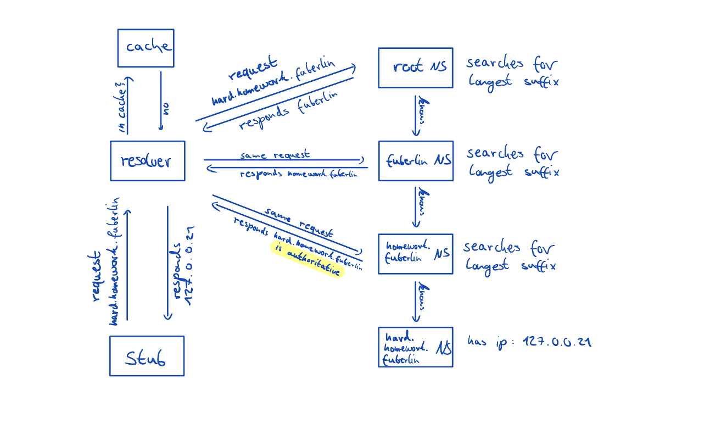

# DNS Simulator

Project for the Telematics course. The objective is to implement essential functionalities of a stub resolver, a recursive resolver, an authoritative DNS server, and to manage namespaces. The project involved the creation of dedicated threads for each DNS server, each listening on their own specific IP addresses and UDP port 53053 to handle incoming requests. Upon receiving a request, a new thread is spawned to process it. Requests are transmitted using JSON strings to demonstrate their utility and clarify their structure.

The recursive resolver incorporates a cache to improve performance and mimics network delays to illustrate the advantages of caching. Additionally, comprehensive log files are generated by each DNS server to document the operations performed.


## Table Of Content

- [Course content](#course-content)
- [Grading](#grading)
- [Getting Started](#getting-started)
  - [Dependencies](#dependencies)
  - [Installation](#installation)
  - [Compile and run](#compile-and-run)
- [Components](#components)
- [Visualized Flow](#visualized-flow)
- [Milestones](#milestones)
- [Test Output](#test-output)
- [Contribution](#contribution)


## Course content

The purpose of this project is to further explore and solidify the concepts learned in the Telematics course.

Telematik ist Telekommunikation mit Hilfe von Mitteln der Informatik und befasst sich mit Themen der technischen Nachrichtenübertragung, Rechnernetze, Internet-Techniken, WWW, und Netzsicherheit.

Behandelte Themen sind unter anderem folgende:
- Allgemeine Grundlagen: Protokolle, Dienste, Modelle, Standards, Datenbegriff;
- Nachrichtentechnische Grundlagen: Signale, Codierung, Modulation, Medien;
- Sicherungsschicht: Datensicherung, Medienzugriff;
- Lokale Netze: IEEE-Standards, Ethernet, Brücken;
- Vermittlungsschicht: Wegewahl, Router, Internet-Protokoll (IPv4, IPv6);
- Transportschicht: Dienstgüte, Flussteuerung, Staukontrolle, TCP;
- Internet: Protokollfamilie rund um TCP/IP;
- Anwendungen: WWW, Sicherheitsdienste, Netzwerkmanagement;
- Neue Netzkonzepte


## Grading

| Assignment  | Grade |
| ------------- | ------------- |
| project | passed  |
| exam  | passed  |

## Getting Started 
### Dependencies

In order for the scripts to work you will need the following packages:
 * `python3`

### Installation
Cloning the repo:
 - `git clone https://github.com/thob97/DNS-simulator.git`

### Compile and run
The main.py file contains several examples to demonstrate the milestones. It can be executed using the following command:
 - `cd DNS-simulator/project_1/src/`
 - `./main.py`

## Components
In our submission, we use the following components:

- **stub_resolver**
    - Our Stub Resolver (Client) queries the Recursive Resolver for the corresponding IP address of domains. The response from the Recursive Resolver is interpreted by the Stub Resolver (successful, failed, etc.).

- **recursive_resolver**
    - The Recursive Resolver receives requests from Stub Resolvers and responses from Name Servers. Requests from Stub Resolvers are attempted to be processed by forwarding them to the Root Name Server. Then, the Name Servers respond. This response either needs to be further processed (sending a new request to another Name Server) or it is complete (authoritative) and can be sent back to the Stub Resolver.

- **nameserver**
    - The Name Servers contain an IP address for their domain name and know the domain names and IP addresses of subordinate Name Servers. When they receive a request, they respond with the Name Server that matches the longest suffix of the query.

- **loghanlder**
    - Has a method for creating log files.

- **cache**
    - Uses a dictionary in which DNS queries will be added. It will search the dictionary for longest prefix from a query, thus acting as a cache. Additionally, it starts a thread when creating the cache that deletes DNS queries when their TTL (time-to-live) is exceeded. It is used in the Recursive Resolver.

- **dns.py**
    - It has useful functions for sending and receiving JSON files via UDP, as well as for creating DNS queries and DNS responses.

- **server_table.json**
    - It contains the Name Servers provided in the task.

- **main.py**
    - The main.py script loads the Name Servers from the server_table.json file and starts them. It also starts the Recursive Resolver and sends multiple test DNS queries via the Stub Resolver to the Recursive Resolver.

- **dns.flags**
    - We use the given flags and the ones shown in the tutorial. However, we omitted the flags dns.count.auth_rr and dns.count.add_rr from the tutorial. Additionally, we use the dns.id flag (Transaction ID), which allows our Recursive Resolver to remember which query came from which Stub Resolver (in case multiple Stub Resolvers make requests simultaneously).
 
  
## Visualized Flow
1. For illustration purposes, queries and responses are represented as domain names and IP addresses. However, these are actually DNS queries with flags. Additionally, Name Servers only have knowledge up to depth 1. (In this example, the root Name Server does not know the homework.fuberlin Name Server.)
   

   
## Milestones
- **Implemented:** Your stub resolver is able to (directly) request an A record from the authorative server.
- **Implemented:** Your recursive resolver is able to discover the authoritative server of a name, and resolve the A record for this name.
- **Implemented:** Your stub resolver is able to resolve any name in the list via the recursive resolver and profits from faster replies in the case of cache hits at the recursive resolver.
- **Not Implemented:** Your DNS implementation is used by an application (see HTTP proxy below).

## Test Output
```
ALL SERVERS STARTED
RESOLVER: STARTED

Test 0 Milestone 1 stub_resolver
 This dns request is send from the stub_resolver directly to the name_server(root)
 stub_resolver asks for:fuberlin
 stub_resolver interprets resp as:127.0.0.26
 Elapsed time:0.10104513168334961

TEST 1 Milestone 2 rekursive_resolver
 This dns request and the following are requested by the stub_resolver and solved with the rekursive_resolver
 This dns request should be successful and take around ~ 0.3sec as the rerkusive_resolver has to send 3 requests
 stub_resolver asks for:easy.homework.fuberlin
 stub_resolver interprets resp as:127.0.0.20
 Elapsed time:0.30408525466918945

TEST 2
 This dns request should be successful and take around ~ 0.1sec as the rerkusive_resolver has to send 1 requests
 stub_resolver asks for:telematik
 stub_resolver interprets resp as:127.0.0.12
 Elapsed time:0.1020052433013916

TEST 3 Milestone 3 cache
 This dns request should be successful and take around ~ 0.2sec as the rerkusive_resolver has to send 3 requests, but one was already cached
 stub_resolver asks for:shop.router.telematik
 stub_resolver interprets resp as:127.0.0.18
 Elapsed time:0.20456624031066895

TEST 4 Milestone 3 cache
 This dns request should be successful and take around ~ 0.0sec as the hole request was already cached
 stub_resolver asks for:shop.router.telematik
 stub_resolver interprets resp as:127.0.0.18
 Elapsed time:0.0007107257843017578

TEST 5
 This dns request should fail because stub_resolver requests a not supported function
 stub_resolver asks for:easy.homework.fuberlin with dns_qry_type=3
 stub_resolver interprets resp as:Not Implemented
 Elapsed time:0.10173559188842773

TEST 6
 This dns request should fail because the nameserver does not find this domain
 stub_resolver asks for:thisdomain.does.not.exist.fuberlin
 stub_resolver interprets resp as:Non-Existent Domain
 Elapsed time:0.10197663307189941

TEST 7
 Sleep 4 seconds
 This dns request should be successful and take around ~ 0.3sec as the resolver has to send 3 requests and the previous accessed cache was removed (ttl)
 stub_resolver asks for:shop.router.telematik
 stub_resolver interprets resp as:127.0.0.18
 Elapsed time:0.3042137622833252

Done. Press Crtl+c to exit
```

## Contribution

* Thore Brehmer - solved project
* Jonny Lam - 
